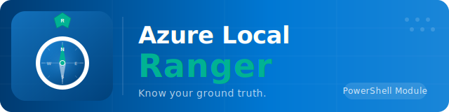

# Azure Local Ranger

> *Know your ground truth.*

Azure Local Ranger is a discovery, documentation, audit, and reporting solution for Azure Local.

It documents an Azure Local deployment as a complete system — the on-prem platform, the workloads running on it, and the Azure resources and Azure-connected services that exist because that deployment is registered, managed, monitored, or extended through Azure.

Ranger supports the range of Azure Local operating models: hyperconverged, switchless, rack-aware, local identity with Azure Key Vault, disconnected operations, and multi-rack deployments.

Ranger serves two primary use cases through the same discovery engine:

- **Current-state documentation** — run at any time to document the environment, its configuration, health, and risk posture.
- **As-built handoff documentation** — run after a deployment to produce a structured documentation package for customer handoff, operations onboarding, or managed-service transition.

## What Ranger Is

Azure Local Ranger is a deep discovery, documentation, audit, and reporting solution for Azure Local.

It produces a complete, structured picture of an Azure Local estate:

| Layer | What Ranger Covers |
|-------|-------------------|
| Physical platform | Nodes, hardware, firmware, BMC, NICs, disks, GPUs, TPM |
| Cluster and fabric | Cluster identity, quorum, fault domains, update posture, registration |
| Storage | S2D, pools, volumes, CSVs, SOFS, storage health and replication |
| Networking | Virtual switches, host vNICs, RDMA, ATC, SDN, DNS, proxy, firewall posture |
| Workloads | VM inventory, placement, density, Arc VM overlays, workload families |
| Identity and security | AD or local identity, certificates, BitLocker, WDAC, Defender, audit posture |
| Azure resources | Arc registration, resource bridge, custom location, policy, monitoring, update, backup |
| Azure services | AKS hybrid, AVD, Arc Data Services, HCI Insights, and related integrations |
| OEM and management | Dell/HPE/Lenovo tooling, WAC, SCVMM, SCOM, operational agents |
| Operational state | Health, performance baseline, event patterns, maintenance posture |

Ranger is not just an on-prem inventory tool and not just an Azure inventory tool. It connects both sides into one Azure Local system view.

## Relationship To Azure Scout

Azure Local Ranger complements [Azure Scout](https://github.com/thisismydemo/azure-scout), but it does not duplicate it.

- **Azure Scout** is broad and cloud-centric — it inventories Azure tenant resources, Entra ID, permissions, cost, policy, and related cloud services.
- **Azure Local Ranger** is deep and deployment-centric — it inventories the Azure Local platform itself, the workloads running on it, and the Azure resources directly tied to that deployment.

See [Ranger vs Scout](docs/ranger-vs-scout.md) for the full comparison.

## Scope Boundary

Ranger discovers everything that makes up, runs on, secures, manages, monitors, or represents an Azure Local deployment.

Evidence is classified into four tiers:

1. **Direct discovery** — Ranger connects to the target and collects data (cluster nodes, OEM hardware, Azure resources).
2. **Host-side validation** — Ranger validates external posture from the node (switch link state, firewall endpoint reachability, DNS resolution).
3. **Optional direct device discovery** — user provides targets and credentials for third-party devices (TOR switches, firewalls).
4. **Manual or imported evidence** — user provides data Ranger cannot discover automatically (network designs, firewall exports, rack assignments).

See [Scope Boundary](docs/scope-boundary.md) for the full breakdown.

## What Ranger Is Not

- a tenant-wide Azure inventory replacement for Azure Scout
- a basic host inventory utility
- a reporting-only layer without deep discovery
- a local-only datacenter tool that ignores Azure integration
- a generic Azure Arc browser with no platform understanding
- a tool that modifies or remediates the environment — Ranger is read-only

## What Ranger Lets Someone Answer

- What exactly is this Azure Local deployment?
- How is it physically built?
- How is it configured?
- What is it hosting?
- How healthy is it?
- How secure is it?
- Which Azure resources represent or govern it?
- Which Azure services are attached to it?
- What are the top operational and architectural risks?

## Output Model

Ranger produces a normalized audit manifest first and generates all outputs from that cached data:

- structured audit data describing the complete Azure Local system
- diagrams covering physical, logical, storage, workload, Azure integration, and deployment-variant relationships
- reports for executive, management, and technical audiences
- as-built documentation packages for project handoff and customer delivery
- regeneration of reports and diagrams from cached data without live cluster access

The model is manifest-first and modular. Ranger ships as one PowerShell module, internally built from small collector and service components.

## Current Project Phase

This repository is in a **documentation and planning phase**. The product definition, scope boundary, architecture model, and public documentation are being stabilised before implementation begins.

The repo currently contains:

- public project documentation aligned to the product-direction plan
- a root PowerShell module shell and module manifest
- GitHub Actions workflows for documentation deployment and validation
- a detailed product-direction plan covering scope, discovery domains, outputs, architecture, and documentation sequencing

Implementation (collectors, report templates, diagram builders) has not started yet.

## Start Here

| Audience | Start Here |
|----------|------------|
| Everyone | [What Ranger Is](docs/what-ranger-is.md) |
| Everyone | [Ranger vs Scout](docs/ranger-vs-scout.md) |
| Everyone | [Scope Boundary](docs/scope-boundary.md) |
| Everyone | [Deployment Variants](docs/deployment-variants.md) |
| Architects and operators | [Architecture Overview](docs/architecture/system-overview.md) |
| Architects and operators | [Discovery Domain Pages](docs/discovery-domains/cluster-and-node.md) |
| Contributors | [Getting Started](docs/contributor/getting-started.md) |
| All | [Roadmap](docs/project/roadmap.md) |

## License

This project is licensed under the MIT License. See [LICENSE](LICENSE).