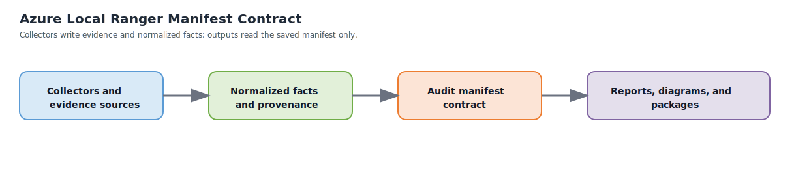

# Audit Manifest

The audit manifest is Ranger’s central contract between collection and rendering.

Collectors write to it. Reports, diagrams, and package builders read from it. If this contract is unclear, the rest of the product drifts.

## Manifest Design Goals

The manifest must:

- represent one Ranger run clearly
- preserve raw-evidence provenance without forcing every renderer to understand raw outputs
- distinguish facts, findings, and imported evidence
- capture partial runs honestly
- support current-state and as-built output generation from cached data

## Top-Level Structure

The intended top-level structure is:

| Section | Purpose |
|---|---|
| `run` | Tool version, schema version, timestamps, operator context, execution mode |
| `target` | Cluster identity, Azure context, intended deployment being documented |
| `topology` | Deployment type, identity mode, control-plane mode, variant markers |
| `collectors` | Per-domain execution status, timings, provenance, and messages |
| `domains` | Normalized domain payloads |
| `relationships` | Cross-domain joins such as node-to-VM, volume-to-CSV, resource-to-cluster |
| `findings` | Derived observations, severity, recommendation, and affected scope |
| `artifacts` | Generated or planned output artifacts |
| `evidence` | Optional raw-evidence references and imported/manual evidence records |

## Manifest Flow



The intended boundary is:

1. collectors gather evidence
2. collectors normalize facts and status
3. the manifest preserves both normalized facts and provenance
4. outputs consume the manifest only

## Required Metadata Blocks

### Run Metadata

The `run` block should include:

- Ranger tool version
- schema version
- collection start and end time
- execution mode (`current-state` or `as-built`)
- workstation or jump-box identity when useful
- selected include or exclude domain filters

### Target Metadata

The `target` block should include:

- cluster name and FQDN
- Azure subscription, resource group, and region where applicable
- node list if known at run start
- environment label or operator-friendly identifier

### Topology Metadata

The `topology` block should include:

- deployment type (`hyperconverged`, `switchless`, `rack-aware`, `disconnected`, `multi-rack`)
- identity mode (`ad`, `local-key-vault`)
- control-plane mode (`connected`, `disconnected`, `mixed`)
- variant markers such as custom location, Arc Resource Bridge, preview multi-rack indicators, or local-identity signals

## Collector Status Model

Each collector should report status independently.

| Status | Meaning |
|---|---|
| `success` | The collector completed and returned the expected normalized payload |
| `partial` | The collector completed but some evidence or subtargets were missing |
| `failed` | The collector should have run but could not complete |
| `skipped` | The collector was intentionally not run because inputs, targets, or credentials were missing or excluded |
| `not-applicable` | The collector does not apply to the detected environment |
| `inconclusive` | Evidence existed but was insufficient to determine a confident result |

Each collector record should also include:

- start and end time
- target scope
- credential scope used
- evidence source summary
- warning or error messages

## Evidence Model

The manifest must distinguish four kinds of content.

| Kind | Meaning |
|---|---|
| Raw evidence | Unshaped source output or references to saved evidence |
| Normalized facts | Cleaned, stable data used by the rest of the product |
| Derived findings | Severity-tagged observations inferred from facts |
| Imported or manual evidence | User-provided data that was not machine-discovered |

Imported evidence must never be disguised as machine-discovered fact. It should be labeled clearly.

## Domain Payloads

The `domains` section should reserve stable payload areas for:

- cluster and node
- hardware
- storage
- networking
- virtual machines
- identity and security
- Azure integration
- OEM integration
- management tools
- performance baseline

Optional or future domains can exist as empty or skipped blocks rather than requiring schema changes later.

## Relationships

The `relationships` section is critical for diagrams and as-built clarity.

Examples include:

- VM to host-node placement
- VHD or disk to volume or CSV backing
- Arc resource to Azure Local cluster relationship
- BMC endpoint to physical node relationship
- workload family to cluster or VM placement

## Findings Model

Each finding should include:

- severity (`critical`, `warning`, `informational`, `good`)
- title
- description
- affected components
- current state
- recommendation
- supporting evidence references when available

## Artifact Contract

The `artifacts` section should describe both generated and expected outputs.

| Artifact type | Current-state expectation | As-built expectation |
|---|---|---|
| Manifest JSON | Required | Required |
| Markdown report | Optional but common | Required |
| HTML report | Common | Required |
| SVG diagrams | Based on available data and selection rules | Required where data supports them |
| Package index or manifest | Optional | Required |

Artifact naming should include cluster name, mode, timestamp, and artifact type.

## Representative Example

The example below shows the intended shape for one representative hyperconverged run.

```json
{
	"run": {
		"toolVersion": "0.1.0",
		"schemaVersion": "1.0.0-draft",
		"mode": "current-state"
	},
	"target": {
		"clusterName": "azlocal-prod-01",
		"resourceGroup": "rg-azlocal-prod-01"
	},
	"topology": {
		"deploymentType": "hyperconverged",
		"identityMode": "ad",
		"controlPlaneMode": "connected"
	},
	"collectors": {
		"cluster-node": { "status": "success" },
		"hardware": { "status": "partial", "reason": "node-02 iDRAC unreachable" },
		"firewall": { "status": "skipped", "reason": "no targets configured" }
	},
	"domains": {
		"clusterNode": {},
		"hardware": {},
		"storage": {},
		"networking": {}
	},
	"findings": [
		{
			"severity": "warning",
			"title": "One hardware endpoint unavailable",
			"affectedComponents": ["node-02"]
		}
	]
}
```

## Why This Must Stabilize Early

If the manifest is unstable, reports, diagrams, and collectors all drift separately. That is why this contract should be defined before broad collector or renderer implementation begins.