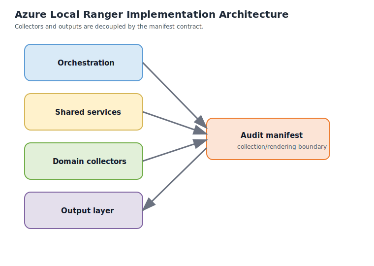

# Implementation Architecture

Azure Local Ranger is intended to ship as one public PowerShell module, but it should be built internally as small, testable components with clean boundaries.

This page documents the logical implementation architecture before broad module development begins.

## Design Goals

The internal design must support:

- independent collectors that can run, fail, or be skipped independently
- one normalized manifest contract between collection and rendering
- outputs rendered from cached data only
- independent test boundaries for collectors, orchestration, schema validation, reports, and diagrams
- future growth into optional and variant-specific domains without a rewrite

## Layered Model

Ranger should be structured in four layers.

### 1. Orchestration Layer

This is the public entry point and run coordinator.

Responsibilities:

- parse parameters and config
- resolve credentials
- determine domain include/exclude behavior
- classify topology and operating variant
- establish execution order
- collect per-domain results
- assemble and persist the manifest
- invoke output renderers against cached data

This layer owns the run, but it should not contain domain-specific collection logic.

### 2. Shared Platform Services

These are reusable services that many collectors depend on.

Responsibilities:

- logging and structured status reporting
- session creation and teardown for WinRM
- Redfish client helpers
- Azure context and token helpers
- retry, timeout, and error normalization
- schema shaping and object normalization
- evidence and provenance helpers
- artifact naming and output-path helpers

These services are the stability layer that keeps collectors focused on domain behavior.

### 3. Domain Collectors

Each discovery domain should be implemented as its own collector boundary.

Planned collectors include:

- topology and deployment-variant classification
- cluster and node
- hardware
- storage
- networking
- virtual machines
- identity and security
- Azure integration
- monitoring and observability
- OEM management
- management tools
- performance baseline

Each collector should:

- accept only the credentials and settings it actually needs
- return normalized results plus raw evidence metadata
- report `success`, `partial`, `failed`, `skipped`, or `not-applicable`
- avoid reaching into other collectors directly

### 4. Output Layer

The output layer consumes saved manifest data.

Responsibilities:

- manifest export
- report generation
- diagram generation
- current-state package generation
- as-built package generation

This layer must not perform live discovery. If an output needs data that is missing, it should mark the output unavailable or skip it with a reason.

## Module Layout

The repo’s planned PowerShell module layout should reflect those boundaries.

| Area | Purpose |
|---|---|
| `Modules/Public` | Public entry points and exported commands |
| `Modules/Private` | Internal helper functions not exported |
| `Modules/Core` | Orchestration, manifest assembly, shared runtime services |
| `Modules/Collectors` | Discovery-domain logic |
| `Modules/Outputs/Reports` | Report renderers |
| `Modules/Outputs/Diagrams` | Diagram renderers and asset helpers |
| `Modules/Internal` | Shared internal models and utilities |

## Public Entry Points vs Internal Functions

Ranger should ship as one public module, but most functions should remain internal.

Planned public entry points:

- `Invoke-AzureLocalRanger` as the main discovery and orchestration command
- `New-AzureLocalRangerConfig` or equivalent helper for generating a starter configuration file
- `Export-AzureLocalRangerReport` or equivalent renderer-focused entry point for rerendering from an existing manifest
- `Test-AzureLocalRangerPrerequisites` or equivalent preflight command

Everything else should default to internal-only unless there is a strong external-automation case for exporting it.

That keeps the public contract small while leaving room to refactor the internal runtime safely.

## Boundaries That Must Stay Clean

Several boundaries should be treated as non-negotiable.

### Collection vs Rendering

Collectors gather evidence. Renderers explain it. The renderers do not reconnect to targets.

### Raw Evidence vs Normalized Facts

Collectors can preserve raw evidence references, but they should hand the rest of the system normalized data and explicit provenance.

### Azure vs Cluster vs OEM Credentials

Credential scopes are not interchangeable. A cluster credential is not assumed to grant domain access. An Azure credential is not assumed to grant BMC access.

### Core vs Optional Domains

Optional domains such as direct switch or firewall interrogation must remain opt-in and must not complicate the standard run path.

## Dependency Posture

Dependencies should be split into required and optional tiers.

| Dependency | Posture | Purpose |
|---|---|---|
| PowerShell 7.x | Required | Primary supported runtime |
| FailoverClusters and built-in Windows management tooling | Required where the target domain needs them | Cluster and platform discovery |
| Az.Accounts and selected Az modules | Required for Azure-side discovery | Azure authentication and Azure resource collection |
| Az.KeyVault | Required when Key Vault references are used | Secret resolution |
| Azure CLI | Optional fallback | Azure auth and Key Vault fallback when PowerShell-only paths are not enough |
| Redfish helpers or lightweight REST wrappers | Required for Dell-first hardware paths | BMC and OEM collection |
| Pester | Required for the test baseline | Unit and integration testing |

Ranger should prefer a minimal required dependency set for the standard runtime and keep device-specific or future-only dependencies optional.

## Runtime Support Posture

The primary target runtime is PowerShell 7.x.

Windows PowerShell 5.1 compatibility can be preserved only where it does not distort the design, but it should not become the constraint that blocks a clean v1 architecture.

That means:

- design for PowerShell 7.x first
- avoid taking dependencies on unsupported or awkward cross-version patterns unless they deliver clear value
- treat 5.1 support as feasible compatibility, not as the main implementation target

## Testing Boundaries

The implementation architecture exists mainly to keep Ranger testable.

| Boundary | What should be tested |
|---|---|
| Collector unit tests | Domain-specific parsing, normalization, and status handling |
| Shared service tests | Key Vault parsing, retry logic, session helpers, error normalization |
| Schema tests | Manifest shape and required fields |
| Orchestration tests | Domain selection, credential routing, collector sequencing |
| Output tests | Report and diagram rendering from saved manifests |
| Acceptance examples | Representative saved manifests for realistic environment shapes |

## Fixture and Mock Strategy

Tests should use layered fixtures rather than live environments for most coverage.

| Test type | Preferred strategy |
|---|---|
| Unit tests | Mock external calls and validate normalization behavior per function or collector |
| Service tests | Mock WinRM, Redfish, and Azure client boundaries rather than mocking internal business logic |
| Schema tests | Validate saved manifest fixtures against the documented schema expectations |
| Output tests | Render reports and diagrams from saved manifest fixtures only |
| Integration tests | Use controlled environment slices or recorded evidence, not broad live-estate dependence |

Representative fixtures should exist for at least these shapes:

- standard hyperconverged connected deployment
- local identity with Azure Key Vault
- partially successful run with missing BMC or Azure evidence
- variant-specific example such as disconnected or multi-rack preview when available

## Reuse With Existing AzureLocal Patterns

Ranger should reuse proven AzureLocal organization patterns rather than inventing new ones without reason.

Examples of what to reuse:

- PowerShell module layout and manifest discipline from existing AzureLocal PowerShell repos
- docs-first structure and MkDocs publication patterns already used in adjacent AzureLocal repositories
- shared naming and evidence-model conventions where they fit the Ranger manifest design
- draw.io plus SVG documentation asset workflow already established across the docs set

Reuse should be deliberate, not blind copying. If an existing pattern pushes Ranger toward a monolithic collector or muddles the manifest boundary, Ranger should keep the cleaner design.

## Non-Goals

These are explicit non-goals for the implementation architecture:

- one giant script with collectors, rendering, and export logic mixed together
- renderers that reconnect to live targets
- implicit credential sharing across unrelated target types
- making optional future domains part of the default run path
- binding the design to one OEM, one topology, or one identity mode forever

## Delivery Sequence

The preferred implementation order is:

1. shared services and manifest schema
2. topology classification and orchestration
3. one collector domain at a time
4. manifest-backed output generation only after the manifest is stable

That sequence keeps Ranger from collapsing into a monolithic script that is hard to reason about and harder to test.
