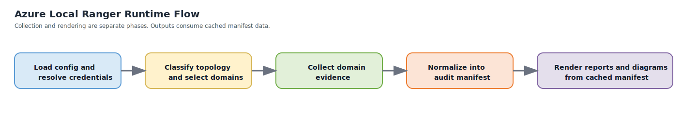

# System Overview

Azure Local Ranger is a manifest-first discovery and documentation system for Azure Local.

It is designed to document one Azure Local deployment as a connected estate: local platform, workloads, Azure-side resources, and the operational or support layers around them.

## Core Runtime Principles

### Discovery First

Ranger discovers and normalizes evidence before it renders reports, diagrams, or handoff packages.

### Single Manifest Contract

All domains feed one audit manifest. That manifest is the system boundary between collection and rendering.

### Cached Rendering

Reports and diagrams render from cached manifest data rather than repeating live discovery on every output run.

### Graceful Degradation

Collectors succeed, fail, or skip independently. Partial visibility is preserved as partial visibility, not collapsed into an all-or-nothing result.

### Read-Only Operation

Ranger documents environments. It does not remediate, reconfigure, patch, or rotate anything.

## Runtime Model

At a high level, one Ranger run looks like this:

1. validate configuration, credentials, and execution environment
2. probe all transport surfaces and record the connectivity matrix in `manifest.run.connectivity`
3. classify topology and operating variant
4. collect evidence by domain using the right protocol for each target
5. normalize results into the audit manifest
6. persist the manifest and supporting evidence references
7. generate current-state or as-built outputs from the cached manifest

## Where Ranger Runs

Ranger should run from a management workstation or jump box with access to the management network, the out-of-band network when needed, and Azure.

That operating model is deliberate:

- cluster nodes may not be able to reach BMC endpoints
- BMC networks are often segmented from host networks
- operators frequently need one workstation that can reach WinRM, Redfish, and Azure

## Protocol Model

| Protocol or tool | Primary use |
| --- | --- |
| WinRM / PowerShell remoting | cluster, storage, networking, VM, security, management-tool, and performance collection |
| Azure Arc Run Command | fallback transport when WinRM ports 5985/5986 are unreachable — routes workloads through the Azure control plane (v1.2.0+) |
| Redfish REST API | Dell-first hardware and BMC discovery |
| Az PowerShell / Azure CLI | Azure integration, policy, monitoring, update, backup, and related services |
| Optional vendor APIs | future direct switch and firewall interrogation |

## Modes of Use

Ranger supports two output modes through the same discovery engine.

### Current-State Documentation

This mode emphasizes operational visibility, findings, and current posture.

### As-Built Documentation

This mode emphasizes handoff-quality structure, richer diagrams, and a more formal package layout.

The difference is in rendering and package composition, not in how discovery fundamentally works.

## Entry Points

Operators can start a run in three ways:

| Entry point | Description |
| --- | --- |
| `Invoke-AzureLocalRanger -ConfigPath` | Standard path — pass a pre-built YAML config file |
| `Invoke-RangerWizard` | Interactive guided wizard — builds the config through prompts and optionally launches the run immediately (v1.2.0+) |
| `Invoke-AzureLocalRanger -ConfigObject` | Automation path — pass an in-memory config hashtable from a script or scheduler |

## Variant Awareness

The runtime must adapt when the environment is:

- hyperconverged
- switchless
- rack-aware
- local identity with Azure Key Vault
- disconnected
- multi-rack preview

Variant awareness affects which domains apply, how findings are worded, and which diagrams or sections are generated.

## What To Read Next

- [How Ranger Works](how-ranger-works.md)
- [Audit Manifest](audit-manifest.md)
- [Implementation Architecture](implementation-architecture.md)
- [Configuration Model](configuration-model.md)
- [Operator Prerequisites](../operator/prerequisites.md)
