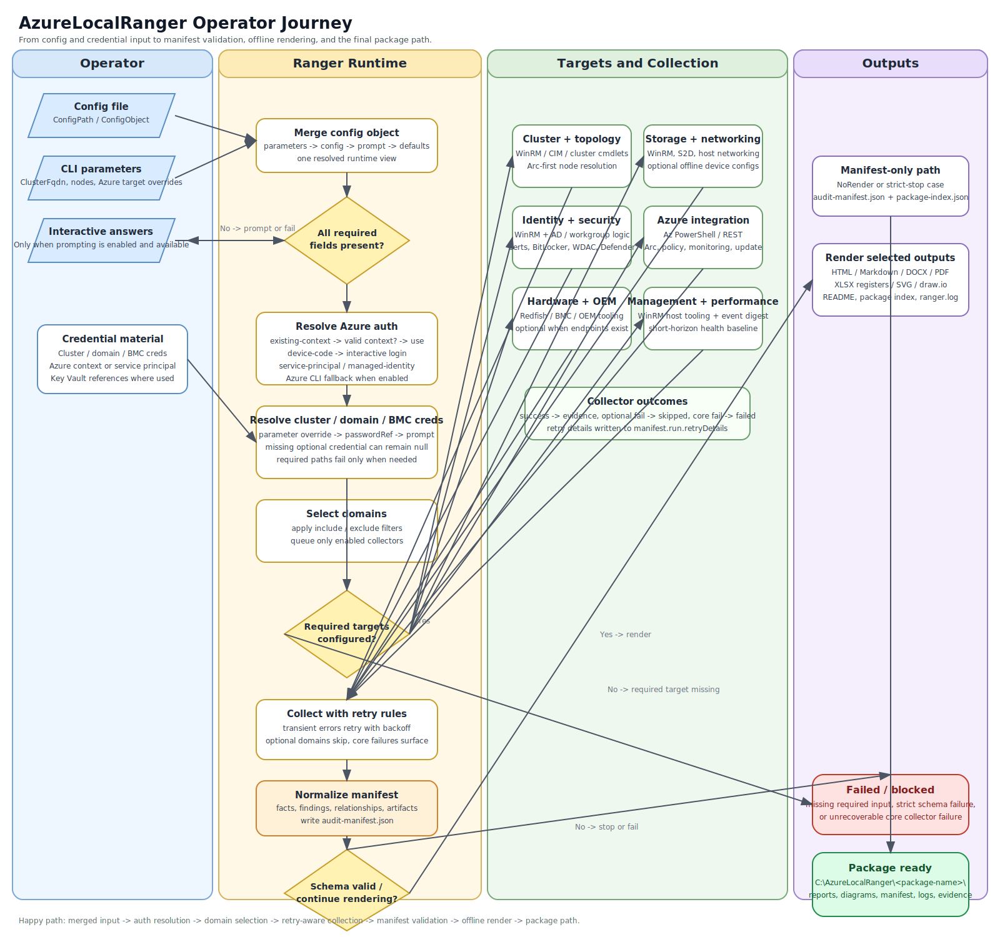

# Quickstart

This is the shortest path from a clean workstation to a finished Ranger package.



## Step 1: Check Prerequisites

```powershell
Test-AzureLocalRangerPrerequisites
```

Use `-InstallPrerequisites` in an elevated session if you want Ranger to install missing RSAT and Az dependencies.

## Step 2: Run Ranger — three paths, ranked

Pick the path that matches how thorough you want to be. All three produce the same output package; they differ only in how you supply configuration.

### Path 1 — Guided wizard (recommended for first runs)

```powershell
Invoke-AzureLocalRanger -Wizard
```

The wizard walks every question — environment, cluster, Azure auth, optional BMC, output mode, scope — with inline GUID validation and a review screen before anything runs. Supports all six Azure auth methods (`existing-context`, runtime prompt, `service-principal`, `managed-identity`, `device-code`, `azure-cli`). At the end you can save the YAML config, launch a run immediately, or both. Existing save paths trigger an overwrite confirmation rather than being silently clobbered.

See the [Wizard Guide](wizard-guide.md) for a full walkthrough with example answers.

### Path 2 — Config file + run

```powershell
New-AzureLocalRangerConfig -Path .\ranger.yml
# edit .\ranger.yml in your editor
Invoke-AzureLocalRanger -ConfigPath .\ranger.yml
```

The generated YAML is annotated and marks mandatory values. Best for version-controlled configs, CI / scheduled runs, and team-standard deployments. You can override any structural value at runtime without editing the file:

```powershell
Invoke-AzureLocalRanger `
  -ConfigPath .\ranger.yml `
  -ClusterFqdn tplabs-clus01.contoso.com `
  -EnvironmentName tplabs-prod-01 `
  -ShowProgress
```

### Path 3 — Parameters or zero-config

```powershell
# Minimum: 2 fields — Ranger lists HCI clusters in the subscription and picks one
Invoke-AzureLocalRanger -TenantId <guid> -SubscriptionId <guid>

# Named cluster: skip the selection prompt
Invoke-AzureLocalRanger -TenantId <guid> -SubscriptionId <guid> -ClusterName <name>

# Bare: prompts interactively for whatever is missing
Invoke-AzureLocalRanger
```

Fastest for ad-hoc runs. Azure Arc auto-discovery fills in the resource group, cluster FQDN, nodes, and AD domain from the selected HCI cluster resource. When exactly one cluster exists in the subscription it's auto-selected; when multiple exist, Ranger prints a numbered menu. Under `-Unattended`, multi-cluster subscriptions throw `RANGER-DISC-002` so the operator knows to pass `-ClusterName`.

!!! tip "`-ShowProgress`"
    Add `-ShowProgress` to any invocation for a live per-collector progress display (requires the optional `PwshSpectreConsole` module; automatically suppressed in CI and `-Unattended` mode).

### Running in disconnected or semi-connected environments

Ranger probes all transport surfaces before collectors run. If cluster nodes are unreachable on WinRM ports but are Arc-registered, it automatically falls back to Arc Run Command transport (requires `Az.ConnectedMachine` and an active Az context). Collectors whose transport is confirmed unavailable are skipped with `status: skipped` rather than failing the run.

## Step 3: Open the Output Package

By default Ranger writes to:

```text
C:\AzureLocalRanger\<environment>-<mode>-<timestamp>\
```

Key artifacts are:

- `manifest\audit-manifest.json`
- `package-index.json`
- `ranger.log`
- `reports\*.html`
- `reports\*.docx`
- `reports\*.pdf`
- `reports\*.xlsx`
- `diagrams\*.svg`

## Step 4: Re-Render Without Live Access

```powershell
Export-AzureLocalRangerReport \
  -ManifestPath .\manifest\audit-manifest.json \
  -Formats html,markdown,docx,xlsx,pdf,svg
```

That reuses the saved manifest and does not reconnect to the cluster or Azure.

## Step 5: Schedule an Unattended Run

For recurring runs, use `-Unattended` so Ranger never prompts for input and emits a scheduler-friendly `run-status.json` file.

```powershell
Invoke-AzureLocalRanger \
  -ConfigPath .\ranger.yml \
  -Unattended \
  -OutputPath \\fileserver\AzureLocalRanger \
  -BaselineManifestPath .\baseline\audit-manifest.json
```

Recommended unattended credential posture:

- Azure: service principal, managed identity, or pre-existing Az context
- Secrets: `keyvault://` references instead of inline passwords
- Scheduler templates: see `samples/task-scheduler-azurelocalranger.xml` and `samples/github-actions-scheduled-ranger.yml`

## Read Next

- [Prerequisites](../prerequisites.md)
- [Configuration](configuration.md)
- [Command Reference](command-reference.md)